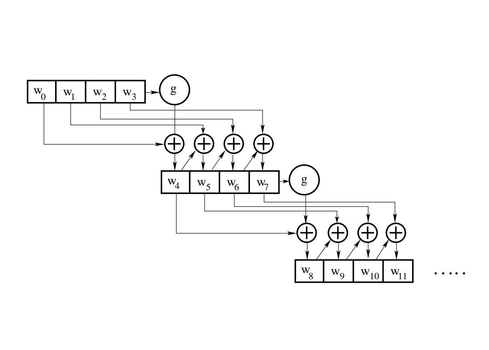

## رمزنگاری AES
## چیستی
در سال 1999  رمزنگاری  Rijndael یکی از سیستم های رمزنگاری برگزیده توسط NIST بود که قابلیت جایگزینی DES را داشتند. این سیستم رمز با کمی تغییر با نام AES توسط NIST معرفی  شد. 

این سیستم رمزنگاری برخلاف DES که از شبکه فایستل استفاده میکند از شبکه جانشینی-جایگشت (Substitution-Permutation Network) بهره میبرد.

در این سیستم اندازه بلوک های رمزنگاری برخلاف مدل اولیه Rijndael ثابت است و هر بلوک از 128-bit معادل  16-Byte معادل  4 word تشکیل شده.


برخلاف اندازه بلوک، اندازه کلید میتواند 128, 192 یا 256 بیت باشد. که به آن کلید اولیه میگوییم. در این پیاده سازی یک کلید را با md5 به اندازه 128 میرسانیم یا از سیستم عامل یک مقدار رندوم به این اندازه مگیریم.

سپس کلید را گسترش داده و از 4 word به 44 word میرسانیم.(برای مود 128 بیتی)

یکی دیگر از اجزای یک SPN یا شبکه جانشینی جایگشت، S BOX است. که به آن میتوان به چشم یک تابع یک به یک غیر خطی و معکوس پذیر نگاه کرد. البته از معکوس آن برای رمزگشایی استفاده خواهیم کرد.


## چرایی
سیستم رمز AES درواقع یک سیستم رمزنگاری متقارن و بلوکی است که آن را برای رمزنگاری فایل ها سمت کاربر مناسب میکند.  هر فایل دقیقا به یک فرد تعلق دارد که همان کاربر است. از طرفی این سیستم مورد تایید NIST نیز هست.

## چگونگی

این سیستم از سه بخش Key, Encryption, Decryption تشکیل شده. در اینجا سعی شده هر بخش به اختصار توضیح داده شود. ابتدا با کلید شروع میکنیم.
### کلید
در این سیستم کلید میتواند 128, 192, 256 بیت باشد. برای سادگی کار با پیشفرض 128 پیش میرویم.
ابتدا یک کلید به اندازه ۱۲۸ بیت را به ۴ word میشکنیم  و آن را در یک آرایه میگذاریم. یعنی حال یک ارایه مثل زیر داریم :

$$
Key=[w_0, w_1, w_2, w_3]
$$

سپس از روی این چهار کلمه چهل کلمه دیگر میسازیم و به این ارایه اضافه میکنیم. چگونه؟ بدین صورت:



```
Algorithm expand_key(K[w_0, w_1, w_2, w_3])
rc = 0x01
for i from 4 upto 44:
	if i mod 4 == 0:
		append xor(k[i-4], g(k[i-1], rc)) 
	else:
		append xor(k[i-4], k[i-1])
```

```
Algorithm g(word, rc)
one byte left circular rotation on word
byte substitutaon with S_BOX on its all 4 bytes
xor rc with lefmost byte
return the value 
```

